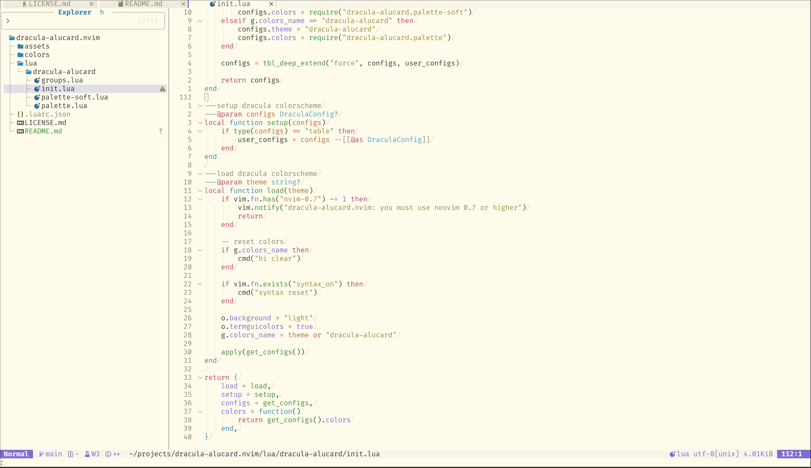
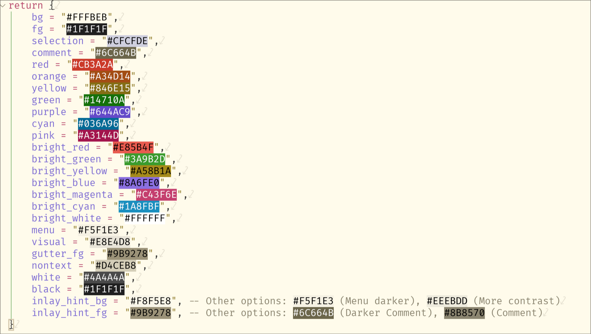

<h1 align="center" >🧛‍♂️ dracula-alucard.nvim</h1>

> A dracula light theme for [NeoVim](https://neovim.io). Based on the great [dracula.nvim](https://github.com/Mofiqul/dracula.nvim)



## ✔️ Requirements

- Neovim >= 0.9.2
- Treesitter (optional, recommended)

## Supported Plugins

This is a fork of [dracula.nvim](https:://github.com/Mofiqul/dracula.nvim) so should support all the same plugins.

- [LSP](https://github.com/neovim/nvim-lspconfig)
- [Treesitter](https://github.com/nvim-treesitter/nvim-treesitter)
- [nvim-compe](https://github.com/hrsh7th/nvim-compe)
- [nvim-cmp](https://github.com/hrsh7th/nvim-cmp)
- [blink.cmp](https://github.com/Saghen/blink.cmp/)
- [Telescope](https://github.com/nvim-telescope/telescope.nvim)
- [NvimTree](https://github.com/kyazdani42/nvim-tree.lua)
- [NeoTree](https://github.com/nvim-neo-tree/neo-tree.nvim)
- [BufferLine](https://github.com/akinsho/nvim-bufferline.lua)
- [Git Signs](https://github.com/lewis6991/gitsigns.nvim)
- [Lualine](https://github.com/hoob3rt/lualine.nvim)
- [LSPSaga](https://github.com/glepnir/lspsaga.nvim)
- [indent-blankline](https://github.com/lukas-reineke/indent-blankline.nvim)
- [nvim-ts-rainbow](https://github.com/p00f/nvim-ts-rainbow)
- [nvim-dap-ui](https://github.com/rcarriga/nvim-dap-ui)
- [mini.indentcope](https://github.com/echasnovski/mini.indentcope)
- [mini.icons](https://github.com/echasnovski/mini.icons)
- [mini.statusline](https://github.com/echasnovski/mini.statusline)

## Install
Install via package manager

```lua
-- Using lazy
{
"jaljoue/dracula-alucard.nvim",
},

```

```lua
-- Using Packer:
use "jaljoue/dracula.nvim"
```

```vim
" Using Vim-Plug:
Plug "jaljoue/dracula.nvim"
```

## Usage

If the color palette is desired to use in other places:

```lua
local colors = require('dracula-alucard').colors()
```

This will return the following table (`dracula-alucard` palette shown):



## Contributing

Contributions adding support for any plugins would be welcome, but ideally they should also be added to [dracula.nvim](https:://github.com/Mofiqul/dracula.nvim)!

## Dracula PRO

[](https://draculatheme.com/pro)

## License

[MIT License](./LICENSE)
